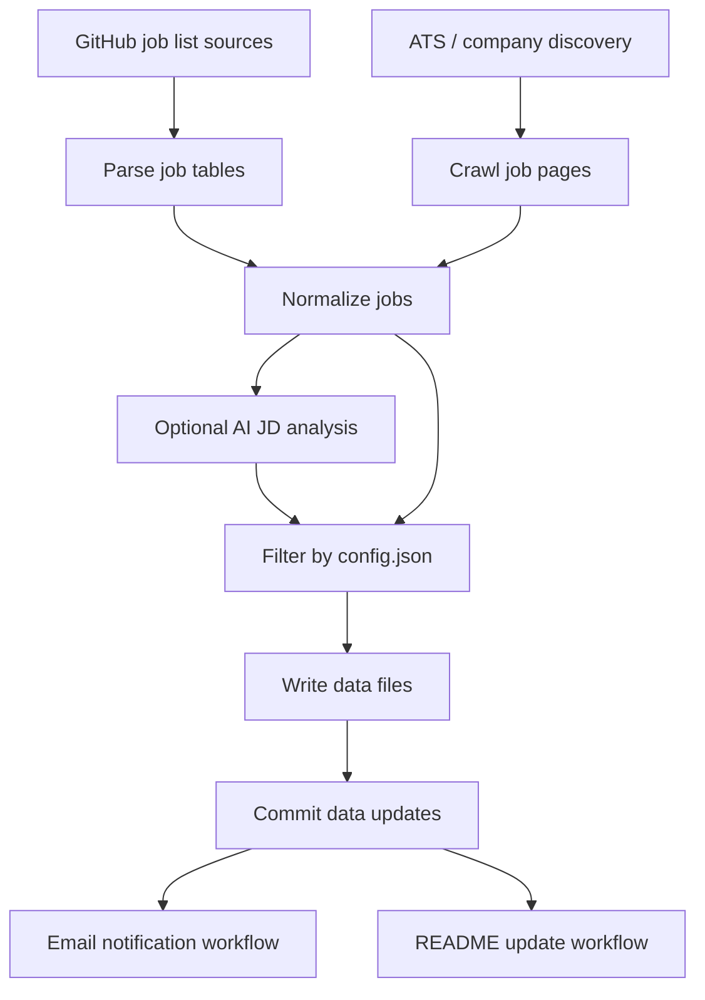

# Installation Guide

This guide explains how to set up **Job Scanner** from the template repository, configure `config.json`, add required secrets, verify the setup, and understand how the scheduled workflows run.

Job Scanner is designed as a **self-hosted GitHub Actions workflow**. Your copy of the repository runs in your own GitHub account, uses your own email sender, and calls your own AI API key when AI analysis is enabled.

---

## 0. What you are installing

At a high level, Job Scanner does this:



The important pieces are:

- `config.json` controls target roles, countries, keywords, AI provider/model, SMTP sender, and receiver email.
- GitHub Actions runs the sync/discovery workflows on a schedule.
- Newly discovered jobs are committed into `data/`.
- A notification workflow sends emails only for newly updated job data.
- A README update workflow regenerates the job board when config or job data changes.

---

## 1. Create your own repository from the template

1. Open the Job Scanner repository.
2. Click **Use this template**.
3. Choose **Create a new repository**.
4. Name your repository.
5. Choose **Public** or **Private**.

> Public repositories are easier for GitHub Actions usage because standard GitHub-hosted runners are free for public repositories. Private repositories may use your account's included GitHub Actions minutes.

Template repositories copy files, not your personal GitHub settings or secrets. After creating your repository, you still need to add secrets and configure `config.json` below.

---

## 2. Enable GitHub Actions

In your new repository:

1. Go to **Actions**.
2. If GitHub asks you to enable workflows, click **I understand my workflows, go ahead and enable them**.

---

## 3. Add the bootstrap secret: `PAT`

Job Scanner commits generated job data and README updates back to your repository. A Personal Access Token is used for those pushes.

In your repository:

1. Go to **Settings → Secrets and variables → Actions**.
2. Click **New repository secret**.
3. Add:

```text
PAT=<your GitHub Personal Access Token>
```

### PAT permissions

For a fine-grained token, use the target repository and grant at least:

- **Contents: Read and write**
- **Issues: Read and write**

Using a PAT instead of the default `GITHUB_TOKEN` is required because commits pushed with the default token do not trigger other workflows via `on: push` — and the data/discovery pipelines rely on their commits triggering the notify and README-update workflows.

> Current repository note: `ats-discovery.yml`, `community-sync.yml`, `clean-outdated-url.yml`, `readme-update.yml`, and `add-job-from-issue.yml` all check out and push using `secrets.PAT`, so `PAT` should be added before running any of them.

---

## 4. Configure `config.json`

Edit `config.json` directly in your repository.

### What each field means

#### Internship targets

```json
"intern": ["summer intern", "off-season intern"]
```

Select internship categories to track:

- `summer intern`
- `off-season intern`

#### Full-time targets

```json
"full-time": ["entry level", "mid level", "senior level"]
```

Select full-time categories to track. Omit this key entirely if you only want internships.

#### Countries

```json
"countries": ["USA", "Canada", "Remote"]
```

Select the countries or regions you want to track.

#### Eligibility filters

These filters apply to every selected country.

```json
"filter": {
  "USA": {
    "allow_citizenship_required": false,
    "allow_no_sponsorship": false
  }
}
```

Recommended for many international students targeting U.S. roles:

```text
allow_citizenship_required: false
allow_no_sponsorship: false
```

That means:

- Exclude jobs that require citizenship.
- Exclude jobs that do not offer sponsorship.

If you want to see more jobs and filter manually later, set one or both options to `true`.

#### Keywords

One keyword per array entry. Any role title needs to contain both an engineering-role word (engineer, developer, researcher, scientist, analyst, trader, etc.) and a domain keyword from this list to be treated as a match — so domain-specific words like `robotics`, `robot learning`, `autonomy`, or `quant` are what let those roles through.

```json
"keywords": [
  "software", "swe", "system", "systems", "backend", "frontend",
  "robot", "robotics", "robot learning", "autonomy", "autonomous",
  "perception", "manipulation", "slam", "ros", "computer vision",
  "quant", "quantitative", "quant trading"
]
```

#### AI enabled

```json
"ai": { "enabled": true, "provider": "google", "model": "gemini-2.5-flash" }
```

If AI is disabled:

- `AI_API_KEY` is not required.
- JD analysis will be skipped.
- Filtering may rely more on parsed job list metadata.

Supported `provider` values: `google`, `anthropic`, `openai`.

#### Email sender / receiver

```json
"sender": { "host": "smtp.gmail.com", "port": 587, "user": "you@gmail.com", "email": "you@gmail.com" },
"receiver": { "email": "you+jobsearch@gmail.com" }
```

For Gmail SMTP, use host `smtp.gmail.com` and port `587`. The sender is the account that authenticates and sends job alerts; the receiver is where alerts land. A Gmail `+alias` on the receiver address (e.g. `you+jobsearch@gmail.com`) still delivers to your inbox and lets you filter/label on it.

`receiver.email` can also be a JSON array to notify multiple people:

```json
"receiver": { "email": ["you+jobsearch@gmail.com", "friend@example.com"] }
```

After editing, validate locally:

```bash
pnpm jobctl setup check-config
```

---

## 5. Add email and AI secrets

Go to:

```text
Settings → Secrets and variables → Actions
```

Add:

```text
SMTP_PASS=<your SMTP password or Gmail App Password>
AI_API_KEY=<your AI provider API key, only required if AI is enabled>
PAT=<your GitHub Personal Access Token>
```

### Gmail App Password

If you use Gmail, do not use your normal Gmail password.

Use a **Gmail App Password**:

1. Enable 2-Step Verification on your Google account.
2. Create an App Password.
3. Save it as the `SMTP_PASS` secret.

If SMTP validation fails with an authentication error, the most common causes are:

- 2FA is not enabled.
- You used your normal Gmail password instead of an App Password.
- The SMTP user does not match the sender account.

---

## 6. Verify your setup

Validate `config.json` and required secrets locally before relying on the schedule:

```bash
SMTP_PASS=... AI_API_KEY=... PAT=... pnpm jobctl setup check-config
```

It validates:

- `config.json`
- SMTP config
- `SMTP_PASS`
- `PAT`
- AI provider and model, if AI is enabled
- `AI_API_KEY`, if AI is enabled

You can also just manually trigger one of the scheduled workflows from the **Actions** tab (see below) — each one runs `check-config` as its first step and fails loudly if something is misconfigured.

---

## 7. Run the workflows manually once

After verification passes, run these workflows manually once from the **Actions** tab.

### Community Sync Pipeline

Workflow file:

```text
.github/workflows/community-sync.yml
```

Manual run:

```text
Actions → Community Sync Pipeline → Run workflow
```

This runs:

```bash
pnpm jobctl sync
```

It parses community-maintained GitHub job lists and commits new job data if anything changed.

### ATS Discovery Pipeline

Workflow file:

```text
.github/workflows/ats-discovery.yml
```

Manual run:

```text
Actions → ATS Discovery Pipeline → Run workflow
```

This runs:

```bash
pnpm jobctl scan
```

It discovers jobs from supported ATS/company sources and commits new job data if anything changed.

### Notify Latest Jobs

Workflow file:

```text
.github/workflows/mail-notify.yml
```

This workflow normally runs when `data/jobs.ndjson` changes.

You can also run it manually:

```text
Actions → Notify Latest Jobs → Run workflow
```

It runs:

```bash
pnpm jobctl notify commit <commit-sha>
```

### Update README

Workflow file:

```text
.github/workflows/readme-update.yml
```

This workflow runs when:

```text
config.json
data/opportunities.ndjson
```

changes. It runs:

```bash
pnpm update-readme
```

and commits README updates if needed.

---

## 8. Workflow schedule and frequency

GitHub cron schedules use **UTC**.

### Community Sync Pipeline

File:

```text
.github/workflows/community-sync.yml
```

Current schedule:

```yaml
schedule:
  - cron: "*/20 14-23 * * *"
  - cron: "*/20 0-4 * * *"
```

This means the community sync runs every 20 minutes during those UTC hour windows.

To reduce cost or email frequency, change this to something slower.

Examples:

Run once per day at 13:00 UTC:

```yaml
schedule:
  - cron: "0 13 * * *"
```

Run every 4 hours:

```yaml
schedule:
  - cron: "0 */4 * * *"
```

### ATS Discovery Pipeline

File:

```text
.github/workflows/ats-discovery.yml
```

Current schedule:

```yaml
schedule:
  - cron: "17 * * * *"
```

This runs once per hour at minute 17.

To run twice per day:

```yaml
schedule:
  - cron: "0 13,23 * * *"
```

### Notify Latest Jobs

File:

```text
.github/workflows/mail-notify.yml
```

This is push-triggered:

```yaml
on:
  push:
    paths:
      - "data/jobs.ndjson"
```

It sends notifications when job data changes.

### README Update

File:

```text
.github/workflows/readme-update.yml
```

This is push-triggered:

```yaml
on:
  push:
    paths:
      - "config.json"
      - "data/opportunities.ndjson"
```

It regenerates the README job board when config or opportunity data changes.

---

## 9. Cost expectations

There are three possible cost areas:

1. GitHub Actions
2. AI API usage
3. Email sending

### GitHub Actions cost

For public repositories, standard GitHub-hosted runners are generally free. For private repositories, GitHub Actions uses your account's included minutes and may bill beyond those included minutes.

To reduce Actions usage:

- Make the repository public if appropriate.
- Reduce cron frequency.
- Disable workflows you do not need.
- Run manually instead of scheduled.

Official reference:

- https://docs.github.com/en/actions/concepts/billing-and-usage

### AI API cost

AI cost depends on:

- Number of job descriptions analyzed
- Average JD length
- Output size
- Selected model
- Whether AI is enabled

The default model in `config.json` is:

```text
gemini-2.5-flash
```

Google's pricing page currently lists Gemini 2.5 Flash Standard text/image/video pricing at:

```text
Input:  $0.30 / 1M tokens
Output: $2.50 / 1M tokens
```

Gemini 2.5 Flash-Lite is cheaper:

```text
Input:  $0.10 / 1M tokens
Output: $0.40 / 1M tokens
```

Official reference:

- https://ai.google.dev/gemini-api/docs/pricing

#### Rough estimate

Use this formula:

```text
cost_per_job =
  input_tokens / 1,000,000 * input_price
  +
  output_tokens / 1,000,000 * output_price
```

Example using Gemini 2.5 Flash:

```text
Input tokens per JD:  5,000
Output tokens per JD:   500

Input cost:  5,000 / 1,000,000 * $0.30 = $0.0015
Output cost:   500 / 1,000,000 * $2.50 = $0.00125

Estimated cost per JD: about $0.00275
```

Approximate cost:

| Jobs analyzed | Approx cost |
| ------------: | ----------: |
|      100 jobs |      ~$0.28 |
|    1,000 jobs |      ~$2.75 |
|   10,000 jobs |     ~$27.50 |

This is only a rough estimate. Actual cost may vary based on prompt size, JD length, model, provider, retries, and pricing changes.

To reduce AI cost:

- Disable AI analysis.
- Use a cheaper model such as `gemini-2.5-flash-lite`.
- Narrow countries and keywords.
- Reduce schedule frequency.
- Avoid reprocessing the same jobs.
- Monitor your AI provider billing dashboard.

### Anthropic and OpenAI

`config.json` also supports `anthropic` and `openai` as the AI provider, but pricing depends on the specific model name you choose.

Official references:

- Anthropic pricing: https://platform.claude.com/docs/en/about-claude/pricing
- OpenAI pricing: https://developers.openai.com/api/docs/pricing

### Email sending cost and limits

Gmail SMTP itself is usually free, but Gmail is not designed for high-volume bulk email.

For personal use, this project should usually stay low-volume because it sends alerts to your own receiver email.

If you plan to send alerts to many subscribers, use a dedicated email service such as Amazon SES, SendGrid, Mailgun, or Resend instead of Gmail SMTP.

Official Gmail sender guidance:

- https://support.google.com/mail/answer/81126

---

## 10. Updating configuration later

Edit `config.json` directly, then commit the change.

After editing, run:

```bash
pnpm jobctl setup check-config
```

---

## 11. Template updates vs forks

Using **Use this template** gives you your own independent copy.

That is good for easy setup, but it means:

- Future changes in the original Job Scanner repository are not automatically applied.
- New features such as new parsers or custom domain support may require manually copying files or recreating your repository from the latest template.

If you want to track upstream changes more closely, use a fork instead of a template, but expect more Git/GitHub complexity.

Recommended for most users:

```text
Use this template
```

Recommended for contributors or advanced users:

```text
Fork
```

---

## 12. Troubleshooting

### Missing `PAT`

Add a repository secret:

```text
PAT=<your GitHub Personal Access Token>
```

### Missing `SMTP_PASS`

Add a repository secret:

```text
SMTP_PASS=<your SMTP password or Gmail App Password>
```

### Missing `AI_API_KEY`

If AI is enabled, add:

```text
AI_API_KEY=<your API key>
```

If you do not want to use AI, disable AI in `config.json`:

```json
"ai": {
  "enabled": false
}
```

### SMTP login failed

For Gmail:

- Use an App Password.
- Make sure 2-Step Verification is enabled.
- Make sure `sender.user` matches the Gmail account.
- Make sure `sender.host` is `smtp.gmail.com`.
- Make sure `sender.port` is `587`.

### No jobs are emailed

Possible reasons:

- No new matching jobs were found.
- Jobs were already sent before.
- Your filters are too strict.
- The sync workflow did not produce changes in `data/`.
- `mail-notify.yml` did not trigger because the expected data path did not change.

### AI cost is higher than expected

Try:

- Disable AI.
- Use `gemini-2.5-flash-lite`.
- Reduce cron frequency.
- Reduce target countries.
- Reduce keywords.
- Check provider dashboard usage.

---

## 13. Local commands

Install dependencies:

```bash
pnpm install
```

Check config locally:

```bash
pnpm jobctl setup check-config
```

Sync community sources:

```bash
pnpm jobctl sync
```

Run ATS discovery:

```bash
pnpm jobctl scan
```

Update README:

```bash
pnpm update-readme
```

Preview email:

```bash
pnpm preview-email
```

---

## 14. Recommended first-run checklist

- [ ] Created repository from template
- [ ] Enabled GitHub Actions
- [ ] Added `PAT`
- [ ] Edited `config.json` directly
- [ ] Added `SMTP_PASS`
- [ ] Added `AI_API_KEY` if AI is enabled
- [ ] Ran `pnpm jobctl setup check-config` locally and it passed
- [ ] Manually ran Community Sync once
- [ ] Manually ran ATS Discovery once
- [ ] Confirmed notification email works
